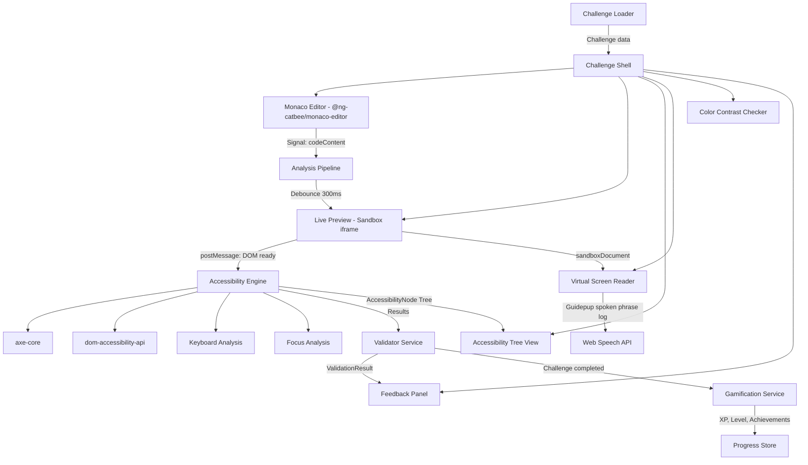
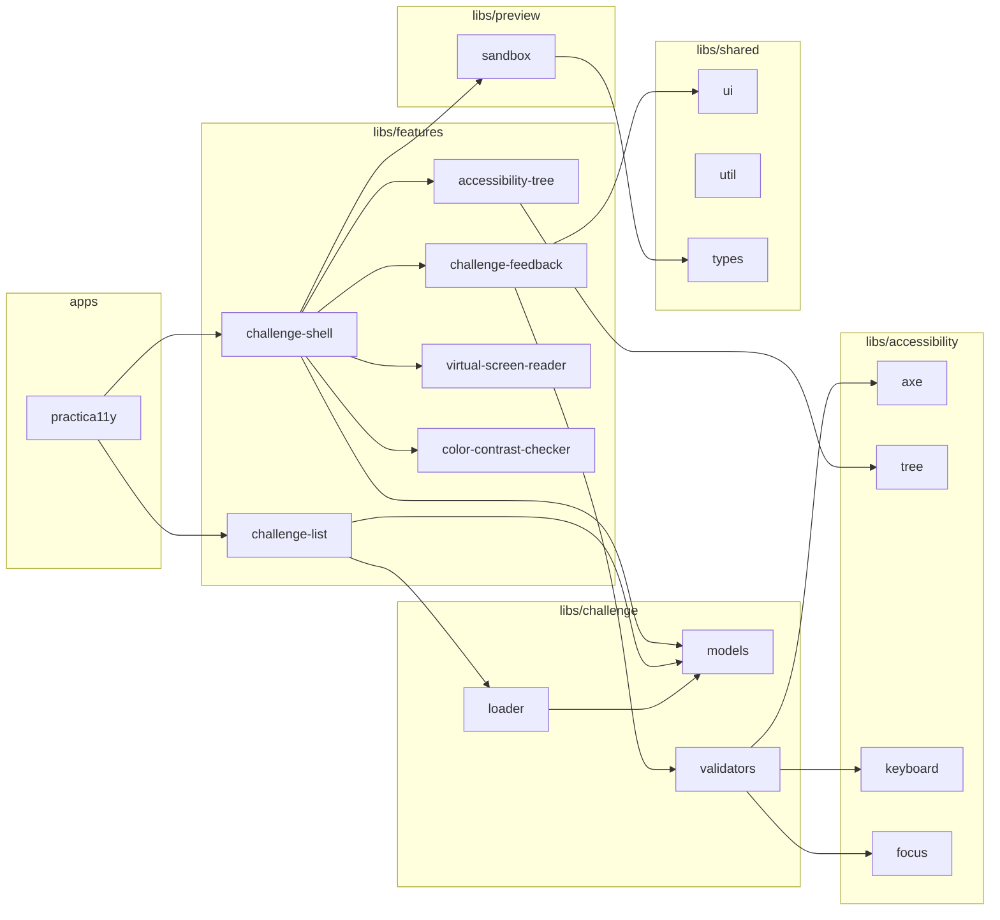

# Architecture Documentation

## System Overview

Practica11y is a fully client-side, gamified learning platform for web accessibility. The application is built on Angular 22+ with Standalone Components, Signals, and Zoneless Change Detection in an Nx monorepo.

The core data flow follows a unidirectional pattern:

No backend required — all data is persisted locally in the browser (localStorage / IndexedDB). Optionally, users can sign in via GitHub (OAuth Device Flow) to sync progress across devices — stored in a private GitHub Gist (`practica11y-sync.json`).

## Nx Library Architecture

The application is organized as an Nx monorepo. Each domain has its own libraries with clear responsibilities:

## Key Feature Components

### challenge-shell

The `challenge-shell` library (`libs/features/challenge-shell/`) orchestrates the editor panel, preview, accessibility tools, and feedback for a given challenge.

#### EditorDiffView

**Location:** `libs/features/challenge-shell/src/lib/editor-diff-view/`

A standalone Angular component that renders stacked Monaco diff editors (one per available language) for comparing the challenge's starter code against the user's current code. It uses `CatbeeMonacoDiffEditor` from `@ng-catbee/monaco-editor` and lives within the existing `challenge-shell` library — no additional Nx library is needed.

The component receives an array of `DiffLanguageEntry` objects and displays a vertical stack of diff editors with language labels. The original (left) side shows the starter code (read-only), and the modified (right) side shows the current editor content (editable). Changes on the modified side propagate back to the parent via an output event.

## Dependency Rules

Clear import restrictions prevent circular dependencies and enforce the layered architecture:

| Library Type     | May Import                                            |
| ---------------- | ----------------------------------------------------- |
| `apps/`          | `features/`, `shared/`                                |
| `features/`      | `challenge/`, `preview/`, `accessibility/`, `shared/` |
| `challenge/`     | `challenge/`, `shared/`                               |
| `preview/`       | `preview/`, `shared/`                                 |
| `accessibility/` | `accessibility/`, `shared/`                           |
| `shared/`        | only other `shared/` libs                             |

### Principles

- **Unidirectional dependency flow**: Apps → Features → Domain libs → Shared
- **No cross-imports**: One domain (e.g., `preview/`) never imports from another domain (e.g., `challenge/`)
- **Shared as foundation**: Only `shared/` libs are used by all other layers
- **Nx Enforce Boundaries**: These rules are enforced via Nx tags and the `@nx/enforce-module-boundaries` ESLint rule

## Editor Panel Architecture

The `ChallengeShell` editor panel supports two view modes: NormalView (tabbed Monaco editors) and DiffView (stacked diff editors). Switching between them is controlled by a `diffViewActive` signal.

### Panel Header Layout

The editor panel header contains three elements side by side:

1. `<a11y-editor-tabs>` — language tab bar (hidden when diff view is active)
2. Diff toggle `<button>` — switches between NormalView and DiffView
3. `<a11y-editor-actions>` — editor toolbar actions

### Conditional Rendering

The panel body uses Angular's `@if` control flow to swap views:

- `@if (!diffViewActive())` — renders the normal tabbed editors
- `@if (diffViewActive())` — renders `<a11y-editor-diff-view>` with bound entries and options

### Accessibility

- The diff toggle button uses `aria-pressed` to communicate its current state to assistive technologies.
- A visually hidden `aria-live="polite"` region announces view mode changes to screen readers (e.g., "Switched to diff view").
- Each stacked diff editor section has an `aria-label` identifying the language (e.g., "HTML diff editor").
- The toggle is a native `<button>`, ensuring keyboard operability via Enter and Space without extra handlers.
