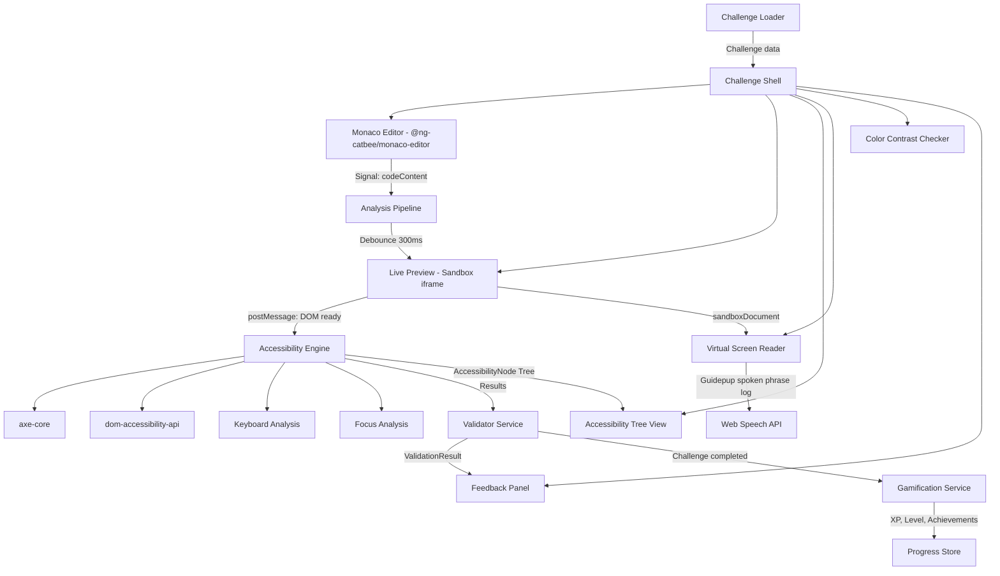

# Architecture Documentation

## System Overview

Practica11y is a fully client-side, gamified learning platform for web accessibility. The application is built on Angular 22+ with Standalone Components, Signals, and Zoneless Change Detection in an Nx monorepo.

The core data flow follows a unidirectional pattern:

No backend required — all data is persisted locally in the browser (localStorage / IndexedDB).

## Nx Library Architecture

The application is organized as an Nx monorepo. Each domain has its own libraries with clear responsibilities:

```mermaid
graph LR
    subgraph apps
        APP[practica11y]
    end

    subgraph libs/features
        FS[challenge-shell]
        FL[challenge-list]
        FF[challenge-feedback]
        FAT[accessibility-tree]
        FVSR[virtual-screen-reader]
        FCC[color-contrast-checker]
    end

    subgraph libs/challenge
        CM[models]
        CL[loader]
        CV[validators]
    end

    subgraph libs/preview
        PS[sandbox]
    end

    subgraph libs/accessibility
        AX[axe]
        AT[tree]
        AK[keyboard]
        AF[focus]
    end

    subgraph libs/shared
        SU[ui]
        SUT[util]
        ST[types]
    end

    APP --> FS
    APP --> FL
    FS --> PS
    FS --> FF
    FS --> FAT
    FS --> FVSR
    FS --> FCC
    FS --> CM
    FL --> CM
    FL --> CL
    FF --> CV
    FAT --> AT
    CV --> AX
    CV --> AK
    CV --> AF
    PS --> ST
    CL --> CM
    FF --> SU
```

## Dependency Rules

Clear import restrictions prevent circular dependencies and enforce the layered architecture:

| Library Type     | May Import                                            |
| ---------------- | ----------------------------------------------------- |
| `apps/`          | `features/`, `shared/`                                |
| `features/`      | `challenge/`, `preview/`, `accessibility/`, `shared/` |
| `challenge/`     | `challenge/`, `shared/`                               |
| `preview/`       | `preview/`, `shared/`                                 |
| `accessibility/` | `accessibility/`, `shared/`                           |
| `shared/`        | only other `shared/` libs                             |

### Principles

- **Unidirectional dependency flow**: Apps → Features → Domain libs → Shared
- **No cross-imports**: One domain (e.g., `preview/`) never imports from another domain (e.g., `challenge/`)
- **Shared as foundation**: Only `shared/` libs are used by all other layers
- **Nx Enforce Boundaries**: These rules are enforced via Nx tags and the `@nx/enforce-module-boundaries` ESLint rule
