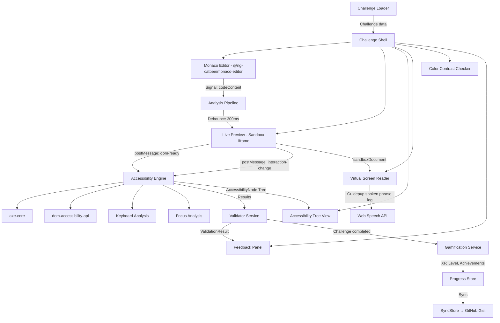
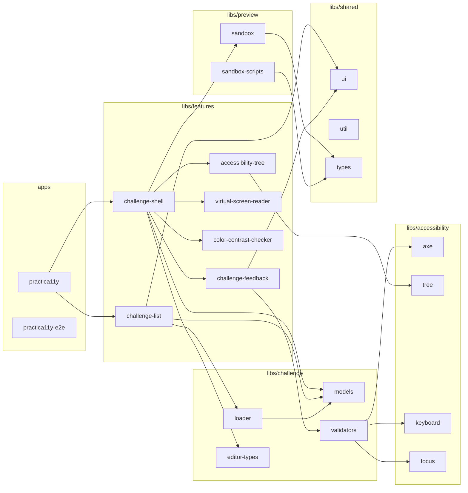

# Architecture Documentation

## System Overview

Practica11y is a fully client-side, gamified learning platform for web accessibility. The application is built on Angular 22+ with Standalone Components, Signals, and Zoneless Change Detection in an Nx monorepo.

The core data flow follows a unidirectional pattern:

No backend required — all data is persisted locally in the browser (localStorage / IndexedDB). Optionally, users can sign in via GitHub (OAuth Device Flow) to sync progress across devices — stored in a private GitHub Gist (`practica11y-sync.json`).

## Nx Library Architecture

The application is organized as an Nx monorepo. Each domain has its own libraries with clear responsibilities:

### Library Inventory

| Domain                | Library                  | Scope Tag             | Description                                                                                                                                                                                              |
| --------------------- | ------------------------ | --------------------- | -------------------------------------------------------------------------------------------------------------------------------------------------------------------------------------------------------- |
| `libs/features/`      | `challenge-shell`        | `scope:features`      | Orchestrates editor, preview, accessibility tools, and feedback for a challenge                                                                                                                          |
|                       | `challenge-list`         | `scope:features`      | Challenge overview with filtering by difficulty/tag and grouping                                                                                                                                         |
|                       | `challenge-feedback`     | `scope:features`      | Feedback panel rendering validation results                                                                                                                                                              |
|                       | `accessibility-tree`     | `scope:features`      | Accessibility tree visualization                                                                                                                                                                         |
|                       | `virtual-screen-reader`  | `scope:features`      | Virtual screen reader simulation with playback controls                                                                                                                                                  |
|                       | `color-contrast-checker` | `scope:features`      | Element color picker + WCAG contrast evaluation                                                                                                                                                          |
|                       | `editor-tab`             | `scope:features`      | _(Scaffolded, not yet implemented)_                                                                                                                                                                      |
|                       | `preview-tab`            | `scope:features`      | _(Scaffolded, not yet implemented)_                                                                                                                                                                      |
|                       | `social-share`           | `scope:features`      | _(Scaffolded, not yet implemented)_                                                                                                                                                                      |
| `libs/challenge/`     | `models`                 | `scope:challenge`     | Challenge data model and types                                                                                                                                                                           |
|                       | `loader`                 | `scope:challenge`     | Frontmatter parser, YAML extraction, challenge loading from registry                                                                                                                                     |
|                       | `validators`             | `scope:challenge`     | Challenge validation logic (axe-based + custom validators)                                                                                                                                               |
|                       | `editor-types`           | `scope:editor`        | Editor file type configuration (language mapping, tab labels, type IDs)                                                                                                                                  |
| `libs/preview/`       | `sandbox`                | `scope:preview`       | Sandbox iframe component for live preview rendering                                                                                                                                                      |
|                       | `sandbox-scripts`        | `scope:preview`       | Scripts injected into the sandbox (axe runner, color picker, link interceptor, DOM mutation observer)                                                                                                    |
| `libs/accessibility/` | `axe`                    | `scope:accessibility` | axe-core integration for WCAG analysis                                                                                                                                                                   |
|                       | `tree`                   | `scope:accessibility` | Accessibility tree generation via dom-accessibility-api                                                                                                                                                  |
|                       | `keyboard`               | `scope:accessibility` | Keyboard/tab-order analysis (focusable elements, non-focusable interactive)                                                                                                                              |
|                       | `focus`                  | `scope:accessibility` | Focus analysis (traps, hidden focusable, focus order)                                                                                                                                                    |
| `libs/shared/`        | `types`                  | `scope:shared`        | Shared TypeScript interfaces and models (accessibility, auth, gamification, persistence, validation, color-contrast, analysis-pipeline)                                                                  |
|                       | `ui`                     | `scope:shared`        | Reusable UI components (ThemeToggle, UserMenu, DeviceFlowDialog, MarkdownContent, DifficultyBadge, PointsBadge, FreshnessBadge, ChallengeMetaBar, EmptyAction)                                           |
|                       | `util`                   | `scope:shared`        | Application-wide services and utilities (AuthStore, SyncStore, Gamification, ProgressStore, LayoutStore, PreferenceSimulationStore, ThemeService, ErrorService, Seo, renderMarkdown, buildSimulationCss) |
|                       | `cross-tab`              | `scope:shared`        | _(Scaffolded, not yet implemented)_                                                                                                                                                                      |

## Key Feature Components

### challenge-shell

The `challenge-shell` library (`libs/features/challenge-shell/`) orchestrates the editor panel, preview, accessibility tools, and feedback for a given challenge. Key internal components:

| Component                | Responsibility                                                             |
| ------------------------ | -------------------------------------------------------------------------- |
| `ChallengeShell`         | Top-level orchestrator with resizable panel grid                           |
| `ShellPanel`             | Individual collapsible panel container                                     |
| `ShellResizer`           | Draggable dividers for resizing columns/rows                               |
| `EditorTabs`             | Language tab bar for HTML/CSS/JS/VTT                                       |
| `EditorActions`          | Editor toolbar (reset, reveal solution)                                    |
| `EditorDiffView`         | Stacked Monaco diff editors (starter vs. current)                          |
| `PreviewPanel`           | Live preview iframe + preference simulation popover                        |
| `FeedbackPanel`          | Validation results display                                                 |
| `InvestigationToolTabs`  | Tab switching: Accessibility Tree / Virtual Screen Reader / Color Contrast |
| `SimulationPopover`      | Media preference overrides (reduced-motion, color-scheme, contrast)        |
| `ChallengeSuccessDialog` | Success modal with confetti and XP notification                            |
| `RevealConfirmDialog`    | Confirmation before revealing the solution                                 |
| `CheatAnimation`         | Visual feedback when solution is revealed                                  |
| `Confetti`               | Particle animation on challenge completion                                 |
| `AnalysisPipeline`       | Service: debounced code → sandbox → analysis → validation                  |
| `ShellLayout`            | Service: reads/writes panel dimensions via LayoutStore                     |

#### EditorDiffView

**Location:** `libs/features/challenge-shell/src/lib/editor-diff-view/`

A standalone Angular component that renders stacked Monaco diff editors (one per available language) for comparing the challenge's starter code against the user's current code. It uses `CatbeeMonacoDiffEditor` from `@ng-catbee/monaco-editor` and lives within the existing `challenge-shell` library — no additional Nx library is needed.

The component receives an array of `DiffLanguageEntry` objects and displays a vertical stack of diff editors with language labels. The original (left) side shows the starter code (read-only), and the modified (right) side shows the current editor content (editable). Changes on the modified side propagate back to the parent via an output event.

### Shared Utility Services

The `libs/shared/util/` library provides application-wide services:

| Service                      | Responsibility                                                                                                                 |
| ---------------------------- | ------------------------------------------------------------------------------------------------------------------------------ |
| `AuthStore`                  | GitHub OAuth Device Flow lifecycle, token persistence, session restoration                                                     |
| `SyncStore`                  | Gist-based cross-device progress sync with merge conflict resolution                                                           |
| `Gamification`               | XP tracking, level calculation (Hatchling→Scout→Guardian→Legend), achievement unlocking                                        |
| `ProgressStore`              | IndexedDB/localStorage persistence for user progress and settings                                                              |
| `LayoutStore`                | Shell panel layout persistence (column widths, row heights, collapsed state, active tab, screen reader settings) via IndexedDB |
| `PreferenceSimulationStore`  | Manages simulated media preferences (reduced-motion, color-scheme, contrast) for the preview sandbox                           |
| `ThemeService`               | Light/dark theme management with system preference detection                                                                   |
| `ErrorService`               | Centralized error collection and display                                                                                       |
| `Seo`                        | Dynamic page title and meta tag management                                                                                     |
| `renderMarkdown`             | Markdown → HTML rendering utility                                                                                              |
| `buildSimulationCss`         | Generates CSS overrides for preference simulation                                                                              |
| `extractSimulatedMediaRules` | Extracts matching `@media` rules for simulated preferences                                                                     |

### Shared UI Components

The `libs/shared/ui/` library provides reusable presentational components:

| Component          | Purpose                                                        |
| ------------------ | -------------------------------------------------------------- |
| `ThemeToggle`      | Light/dark mode toggle button                                  |
| `UserMenu`         | Avatar dropdown with sync controls and sign-out                |
| `DeviceFlowDialog` | Native `<dialog>` for GitHub Device Flow code entry            |
| `MarkdownContent`  | Renders markdown safely as HTML                                |
| `DifficultyBadge`  | Visual indicator for challenge difficulty level                |
| `PointsBadge`      | Displays XP points value for a challenge                       |
| `FreshnessBadge`   | "New" or "Updated" badge for recently added/changed challenges |
| `ChallengeMetaBar` | Combines difficulty, points, and tags into a metadata row      |
| `EmptyAction`      | Empty state with call-to-action                                |

## Dependency Rules

Clear import restrictions prevent circular dependencies and enforce the layered architecture:

| Library Type     | Scope Tag             | May Import                                                                                                  |
| ---------------- | --------------------- | ----------------------------------------------------------------------------------------------------------- |
| `apps/`          | `scope:app`           | `scope:features`, `scope:shared`, `scope:challenge`                                                         |
| `features/`      | `scope:features`      | `scope:features`, `scope:challenge`, `scope:editor`, `scope:preview`, `scope:accessibility`, `scope:shared` |
| `challenge/`     | `scope:challenge`     | `scope:challenge`, `scope:shared`                                                                           |
| `editor/`        | `scope:editor`        | `scope:editor`, `scope:shared`                                                                              |
| `preview/`       | `scope:preview`       | `scope:preview`, `scope:shared`                                                                             |
| `accessibility/` | `scope:accessibility` | `scope:accessibility`, `scope:shared`                                                                       |
| `shared/`        | `scope:shared`        | only other `scope:shared` libs                                                                              |

### Principles

- **Unidirectional dependency flow**: Apps → Features → Domain libs → Shared
- **No cross-imports**: One domain (e.g., `preview/`) never imports from another domain (e.g., `challenge/`)
- **Shared as foundation**: Only `shared/` libs are used by all other layers
- **Nx Enforce Boundaries**: These rules are enforced via Nx scope tags and the `@nx/enforce-module-boundaries` ESLint rule in `eslint.config.mjs`

## Editor Panel Architecture

The `ChallengeShell` editor panel supports two view modes: NormalView (tabbed Monaco editors) and DiffView (stacked diff editors). Switching between them is controlled by a `diffViewActive` signal.

### Panel Header Layout

The editor panel header contains three elements side by side:

1. `<a11y-editor-tabs>` — language tab bar (hidden when diff view is active)
2. Diff toggle `<button>` — switches between NormalView and DiffView
3. `<a11y-editor-actions>` — editor toolbar actions

### Conditional Rendering

The panel body uses Angular's `@if` control flow to swap views:

- `@if (!diffViewActive())` — renders the normal tabbed editors
- `@if (diffViewActive())` — renders `<a11y-editor-diff-view>` with bound entries and options

### Accessibility

- The diff toggle button uses `aria-pressed` to communicate its current state to assistive technologies.
- A visually hidden `aria-live="polite"` region announces view mode changes to screen readers (e.g., "Switched to diff view").
- Each stacked diff editor section has an `aria-label` identifying the language (e.g., "HTML diff editor").
- The toggle is a native `<button>`, ensuring keyboard operability via Enter and Space without extra handlers.

## Application Pages

The app uses lazy-loaded route-level components:

| Route             | Component             | Description                                                      |
| ----------------- | --------------------- | ---------------------------------------------------------------- |
| `/`               | `HomePage`            | Landing page with introduction and call-to-action                |
| `/challenges`     | `ChallengesPage`      | Challenge list with filtering, grouping, and progress indicators |
| `/challenges/:id` | `ChallengeDetailPage` | Full challenge workspace (editor + preview + tools + feedback)   |
| `/about`          | `AboutPage`           | Project information, credits, and licenses                       |

## Deployment

- **Hosting**: GitHub Pages via `deploy.yml` workflow
- **Build output**: `dist/apps/practica11y/browser/`
- **Custom domain**: `practica11y.dev` (CNAME in repo)
- **CI pipeline**: `ci.yml` → `checks.yml` (lint, test, build, e2e in parallel) → deploy
- **Worker**: `deploy-worker.yml` deploys the CORS proxy on push to `workers/github-auth-proxy/`
