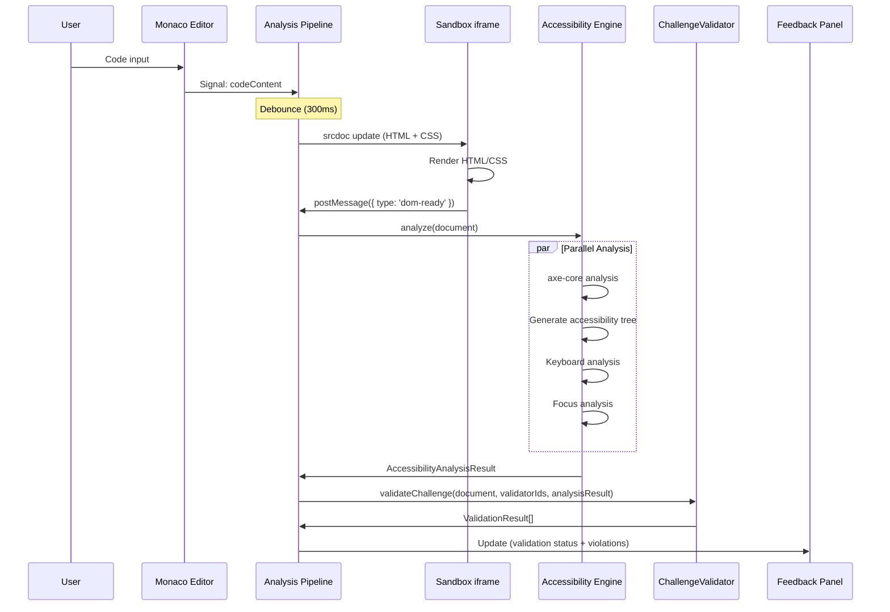
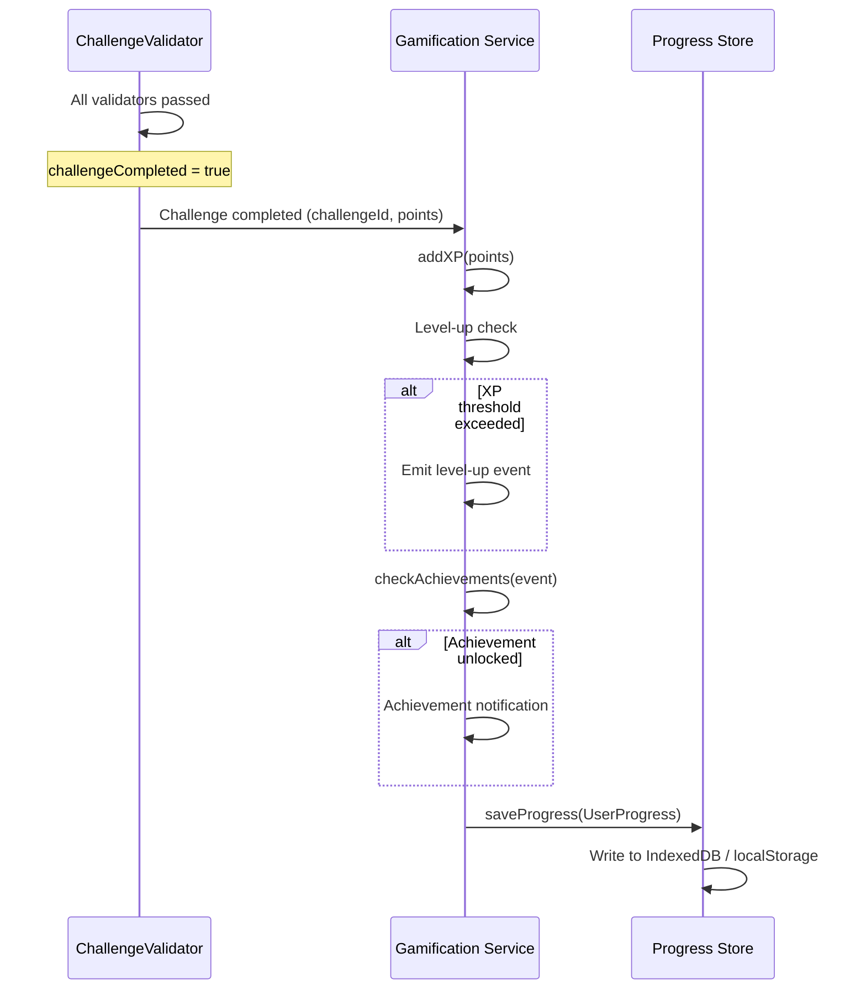
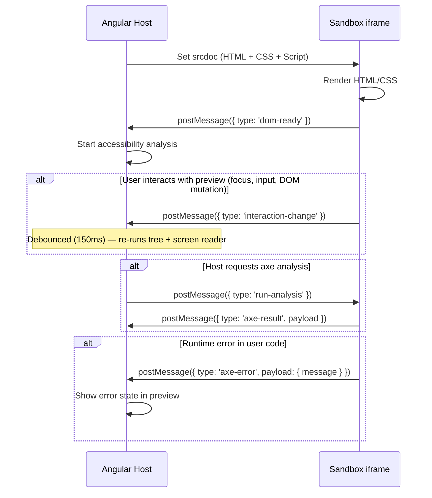
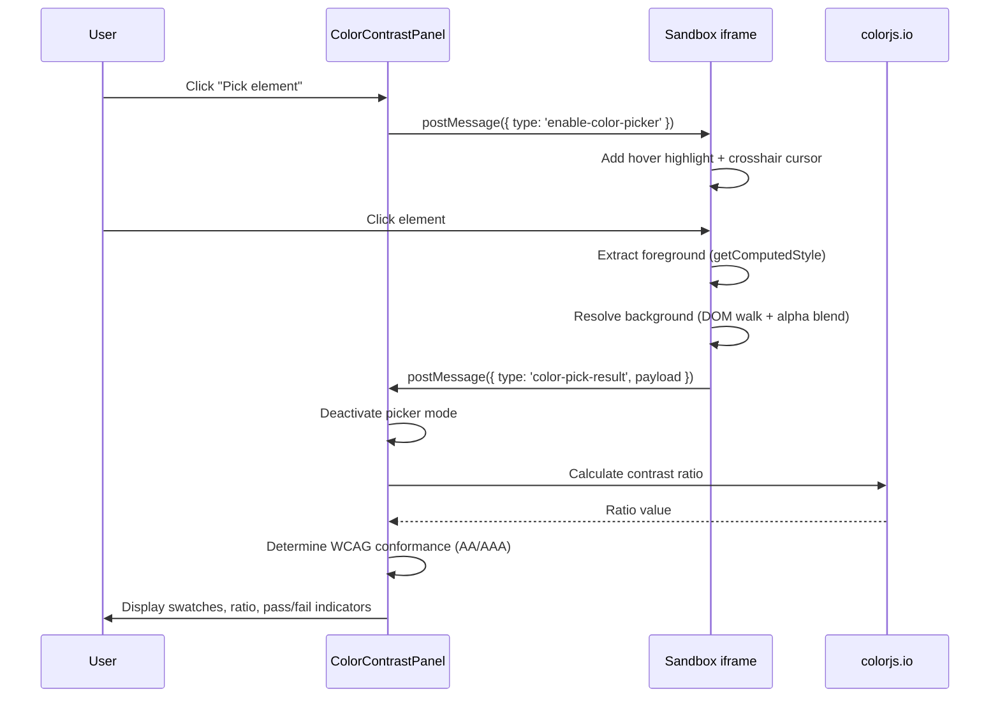
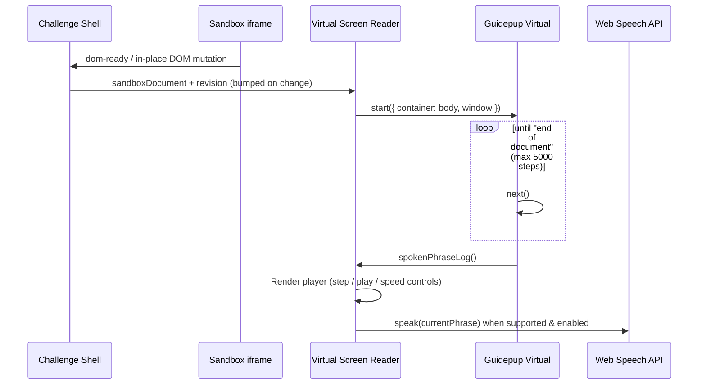
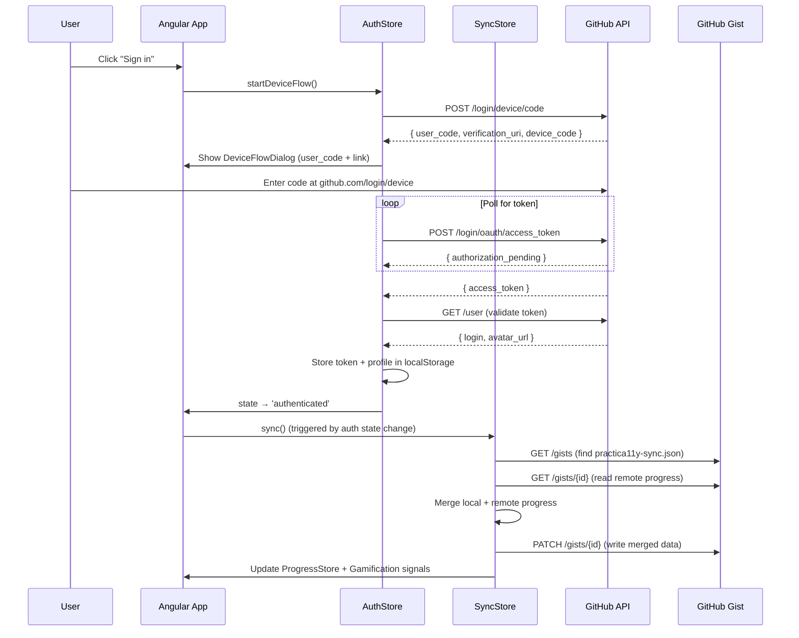
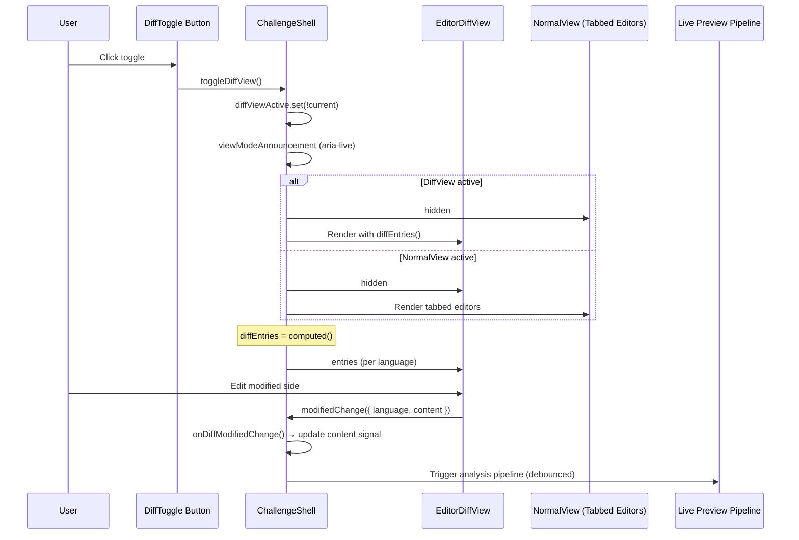

# Data Flow Documentation

## Analysis Pipeline

The Analysis Pipeline is the heart of the application. It coordinates the data flow from editor changes to feedback:

### Detailed Flow

1. **Editor input**: User types code in Monaco Editor → Signal `codeContent` is updated
2. **Debounce**: After 300ms without further input, the pipeline is triggered
3. **Sandbox update**: The new HTML/CSS code is written as `srcdoc` into the iframe
4. **DOM Ready**: The iframe sends a `dom-ready` event to the host via `postMessage`
5. **Accessibility Engine**: Runs four analyses in parallel:
   - **axe-core**: Detect WCAG violations
   - **Accessibility Tree**: Generate semantic tree structure
   - **Keyboard**: Focusability, tab order, non-focusable interactive elements
   - **Focus**: Focus traps, hidden focusable elements, focus order
6. **Validation**: ChallengeValidator checks all registered validators against the analysis results
7. **Feedback**: The Feedback Panel is updated with validation status and violations

## Gamification Flow

When a challenge is successfully completed, the gamification flow kicks in:

### Detailed Flow

1. **Challenge completed**: All `ValidationResult.passed === true` → Challenge is considered completed
2. **Add XP**: `Gamification.addXP(challenge.points)` → new XP value
3. **Check level-up**: Compare new XP value with thresholds (Hatchling → Scout → Guardian → Legend)
4. **Check achievements**: Certain actions trigger achievements (e.g., "First Fix", "Form Master")
5. **Persist**: The entire progress is written via `ProgressStore` to IndexedDB/localStorage

## Sandbox Communication

Communication between the host application and the sandbox iframe is exclusively via `postMessage`:

### Message Protocol

| Direction     | Message Type           | Payload                            | Purpose                                                                                    |
| ------------- | ---------------------- | ---------------------------------- | ------------------------------------------------------------------------------------------ |
| Iframe → Host | `dom-ready`            | —                                  | Signals the iframe document has loaded; triggers initial analysis                          |
| Iframe → Host | `interaction-change`   | —                                  | User interaction or DOM mutation in preview; debounced at 150ms to avoid excessive updates |
| Host → Iframe | `run-analysis`         | —                                  | Request axe-core analysis                                                                  |
| Iframe → Host | `axe-result`           | `AxeResults`                       | axe-core analysis results                                                                  |
| Iframe → Host | `axe-error`            | `{ message }`                      | axe-core analysis failed                                                                   |
| Host → Iframe | `enable-color-picker`  | —                                  | Activate element color picker mode                                                         |
| Host → Iframe | `disable-color-picker` | —                                  | Deactivate color picker mode                                                               |
| Iframe → Host | `color-pick-result`    | `{ fg, bg, fontSize, fontWeight }` | Color data for selected element                                                            |

### Live Updates via Interaction Observer

The sandbox script (`sandbox-scripts`) observes in-place DOM changes and user interactions to notify the host for live accessibility tree / screen reader updates:

- **MutationObserver** on `#user-content`: watches attributes, child list, subtree, and character data changes
- **Event listeners**: `input`, `change` (form values), `focusin`, `focusout` (focus state changes)
- All triggers are **debounced at 150ms** before sending `interaction-change` to avoid flooding the host during rapid interactions

This allows the accessibility tree and virtual screen reader to stay in sync with user interactions (e.g., toggling ARIA attributes via JavaScript, focusing form fields) without requiring a full srcdoc reload.

### Link Interception

The sandbox script intercepts all anchor clicks to prevent navigation (which would destroy the srcdoc iframe):

- **In-page anchors** (`#id`): Scrolls smoothly to the target element
- **External/relative URLs**: Shows a toast notification ("Navigation blocked → {url}") via an accessible `aria-live` region
- This ensures learner code with `<a href="...">` elements does not break the preview

### Security Model

- The iframe uses `sandbox="allow-scripts"` — no access to parent DOM, no navigation
- User code is **never** executed in the Angular context
- Errors in user code are caught inside the iframe and communicated via `postMessage`

### Script Loading & Caching

The sandbox iframe includes two static scripts (`axe.min.js` and `sandbox-analysis.js`) via `<script src="...">` tags in the generated `srcdoc`. Because `srcdoc` is a computed signal, **every content change** (debounced at 300ms) replaces the entire iframe document, causing the browser to re-request both scripts.

This is **by design** and not a performance concern:

- **HTTP 304 responses**: The browser sends conditional requests (If-None-Match), receives a header-only 304 (no body transfer), and serves from disk/memory cache. The network cost is ~2-3ms per script.
- **Clean execution environment**: Each srcdoc replacement guarantees a fresh JavaScript context with no state leaks between runs — critical for accurate accessibility analysis.
- **Script re-evaluation**: While the scripts are re-parsed and executed on each reload, `sandbox-analysis.js` is minimal (~2KB bundled) and `axe.min.js` evaluation is fast from warm cache.

An alternative approach (injecting scripts once via Blob URLs and updating content via `postMessage`) would eliminate re-evaluation but sacrifice the isolation guarantee and significantly increase architectural complexity. The current trade-off favors correctness and simplicity over marginal performance gains.

## Color Contrast Checker Flow

The Color Contrast Checker allows learners to pick elements in the live preview and inspect their foreground/background contrast against WCAG 2.1 thresholds:

### Detailed Flow

1. **Picker activation**: User clicks the "Pick element" button → panel sends `enable-color-picker` to the iframe
2. **Element selection**: Iframe adds hover highlight and intercepts clicks. On click, it extracts `color` and resolves the effective `background-color` by walking the DOM tree and alpha-blending ancestors
3. **Result message**: Iframe sends `color-pick-result` with foreground color, background color, font-size, and font-weight to the parent window
4. **Calculation**: The panel uses `colorjs.io` to calculate the WCAG 2.1 contrast ratio and determines AA/AAA conformance for both normal and large text
5. **Display**: Swatches, hex values, formatted ratio, and pass/fail indicators are rendered. An `aria-live` region announces the result to screen readers
6. **Reset**: When the iframe reloads (`dom-ready` message), the panel returns to its empty state

## Virtual Screen Reader Flow

Alongside the Accessibility Tree, the Challenge Shell exposes a **Virtual Screen Reader** tab that simulates how a screen reader would announce the live preview content:

### Detailed Flow

1. **Document handoff**: On `dom-ready` (reload) or an in-place DOM mutation, the shell sets `sandboxDocument` and bumps `srRevision` to re-trigger the simulation.
2. **Phrase generation**: The `screen-reader-engine` runs Guidepup's `Virtual` across the preview `body`, stepping through the content until it reaches `end of document` (guarded by a `MAX_STEPS` limit), then collects the full spoken phrase log.
3. **Playback**: The component renders an accessible player — users can step forward/backward, jump to a phrase, play the announcement once (stopping automatically at the end) and adjust the playback rate (0.5×–2×). Pressing play again restarts from the beginning.
4. **Voicing**: When the Web Speech API is available and enabled, each active phrase is voiced through `SpeechSynthesis` at the selected rate.

The selected output tab (Accessibility Tree vs. Virtual Screen Reader) and the playback rate are persisted via the `LayoutStore` (IndexedDB), so they are restored across sessions.

> The simulation runs entirely client-side and is purely read-only — it never mutates the preview document.

## GitHub Sync Flow (Cross-Device Progress)

Users can optionally sign in with GitHub to sync their progress across devices. Authentication uses the OAuth Device Flow (RFC 8628), and progress is stored in a private Gist.

### Sync Strategy: Merge

Instead of last-write-wins, the sync uses a **merge strategy** that preserves progress from both sides:

| Field                 | Merge Rule                                                |
| --------------------- | --------------------------------------------------------- |
| `completedChallenges` | Union of local and remote (no duplicates)                 |
| `peekedChallenges`    | Union of local and remote                                 |
| `achievements`        | Union by ID (earliest `unlockedAt` wins)                  |
| `xp`                  | `Math.max(local, remote)`                                 |
| `currentLevel`        | Level corresponding to the higher XP                      |
| `lastActivity`        | Most recent timestamp                                     |
| `settings`            | Last-write-wins (from the side with newer `lastActivity`) |

After merging:

- If merged differs from local → update local (IndexedDB + Gamification signals)
- If merged differs from remote → update Gist

### Gist Storage

Progress is stored in a **private Gist** containing a single file:

- **Filename**: `practica11y-sync.json`
- **Format**: `{ version: 1, progress: SerializedUserProgress, settings: UserSettings }`
- **Scope**: The OAuth app requests the `gist` scope only

The Gist is identified by searching the authenticated user's gists for one containing `practica11y-sync.json`.

### Sync Triggers

| Trigger                 | Description                                        |
| ----------------------- | -------------------------------------------------- |
| After sign-in           | Immediate sync when auth state → `authenticated`   |
| App load (stored token) | Sync after token validation on initialization      |
| Challenge completion    | Sync after `markChallengeCompleted()` + XP awarded |
| Manual sync button      | User clicks "Sync now" in the User Menu dropdown   |

### CORS Proxy (Cloudflare Worker)

GitHub's OAuth endpoints (`github.com/login/*`) do not support CORS from browser origins. A Cloudflare Worker (`workers/github-auth-proxy/`) acts as a CORS proxy for both local development and production:

- `POST /login/device/code` → `https://github.com/login/device/code`
- `POST /login/oauth/access_token` → `https://github.com/login/oauth/access_token`

The worker is deployed at `https://github-auth-proxy.practica11y.workers.dev` and is used by both environment configurations (dev and prod), eliminating the need for a separate Angular dev server proxy. This ensures consistent behavior across environments — if auth works locally, it works in production.

See `docs/github-auth-proxy.md` for setup and deployment details.

### Token Lifecycle

1. App boots → `AuthStore.initialize()` checks localStorage for `practica11y-auth`
2. If found: set `user` signal immediately (instant UI), validate via `GET /user`
3. Valid → `authenticated`, trigger sync
4. Invalid (401/403) → clear token, `unauthenticated`
5. On logout → clear localStorage, reset signals

## Diff View Flow

The Diff View provides a side-by-side comparison of starter code (original) against the user's current code (modified) for each available language in a challenge. A toggle button switches between the normal tabbed editor and the stacked diff view.

### Detailed Flow

1. **Toggle activation**: User clicks the DiffToggle button → `diffViewActive` signal is toggled. An `aria-live` region announces the mode change ("Switched to diff view" / "Switched to code editor").
2. **Conditional rendering**: `@if (diffViewActive())` renders the `EditorDiffView`; otherwise the normal tabbed editors are shown. Editor tabs are hidden when diff is active.
3. **Diff entries computation**: The `diffEntries` computed signal builds a `DiffLanguageEntry[]` array from the challenge starter signals (original side) and current content signals (modified side). HTML and CSS are always included; JS and VTT are included only when the challenge starter provides them.
4. **Editing in diff view**: When the user edits the modified side of any diff editor, `CatbeeMonacoDiffEditor` emits an `editorDiffUpdate` event. `EditorDiffView` re-emits it as `modifiedChange({ language, content })`.
5. **Content signal propagation**: `ChallengeShell.onDiffModifiedChange()` routes the change to the appropriate content signal (`htmlContent`, `cssContent`, `jsContent`, or `vttContent`) via the existing `onXxxContentChange()` methods. This triggers the standard analysis pipeline (debounce → sandbox update → accessibility engine → validation → feedback).
6. **Auto-open on solution reveal**: An `effect` watches `solutionRevealed()`. When it becomes `true`, the effect sets `diffViewActive` to `true` and announces the switch, so the user immediately sees the diff between starter and solution code.
